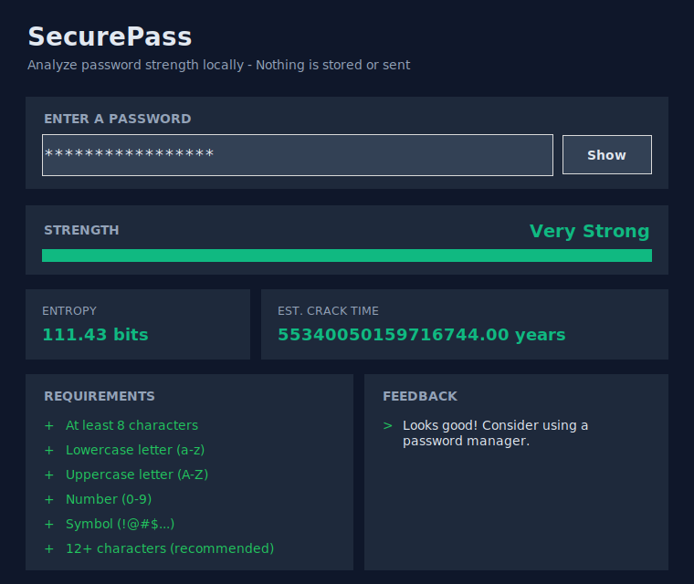
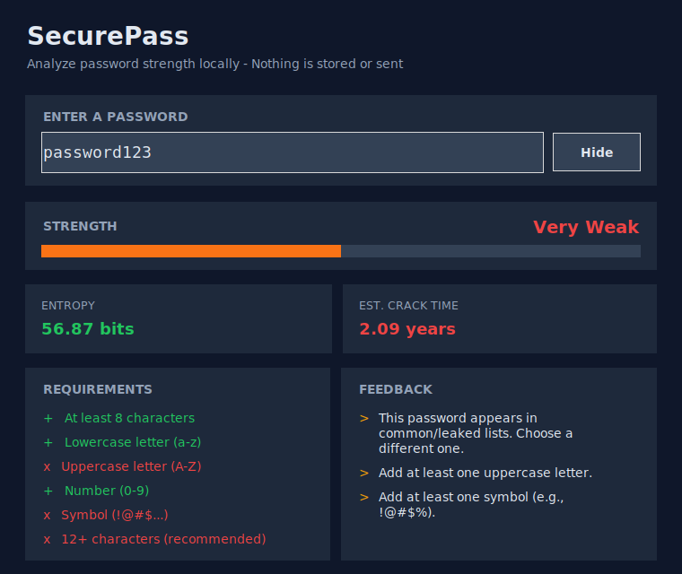

# SecurePass — Password Strength Checker

A local-first password strength analyzer built as a cybersecurity project. Weak passwords are still a top cause of account breaches — most online strength checkers send your password to their servers. This one doesn't.

## Features

- ✅ Policy checks: length, lowercase, uppercase, digit, symbol
- ✅ Entropy estimation (bits) + rough crack-time calculation
- ✅ Local check against a curated common/leaked password list (~300 entries)
- ✅ Modern dark-themed Tkinter GUI + CLI
- ✅ Python standard library only — no external dependencies
- ✅ 100% offline: no logging, no storage, no network calls

## Screenshots

**Very Strong password**



**Very Weak password (detected in common list)**



## Quick Start

```bash
# Clone and run — no pip install needed
git clone <your-repo-url>
cd password-strength-checker

# GUI
python src/gui_tkinter.py

# CLI
python src/cli.py
python src/cli.py -p "MyP@ssw0rd!"
```

## How it works

1. **Policy engine** — regex checks for length, case, digits, symbols
2. **Entropy calculation** — `bits = length × log₂(charset_size)`
3. **Crack-time estimate** — assumes 1 billion guesses/sec (educational approximation of a modern GPU rig)
4. **Common-password check** — O(1) lookup against a local wordlist

## Project structure

```
password-strength-checker/
├── data/common_passwords.txt      # curated wordlist
├── src/
│   ├── password_strength.py       # core logic (entropy, checks, scoring)
│   ├── gui_tkinter.py             # modern dark-theme GUI
│   └── cli.py                     # command-line interface
├── tests/test_password_strength.py
└── screenshots/
```

## Roadmap

- [ ] Integrate the full SecLists top-10k password list
- [ ] Add HaveIBeenPwned k-anonymity API as an optional online check
- [ ] zxcvbn-style pattern detection (dates, keyboard walks, l33t-speak)
- [ ] Export strength report as JSON

## Security & Privacy

Everything runs locally on your machine. The app never logs, stores, or transmits your password — all analysis happens in memory and is discarded when you close the window.

## License

MIT — see `LICENSE`.
